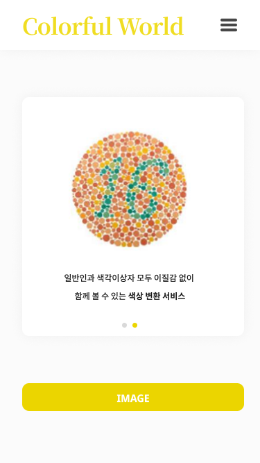
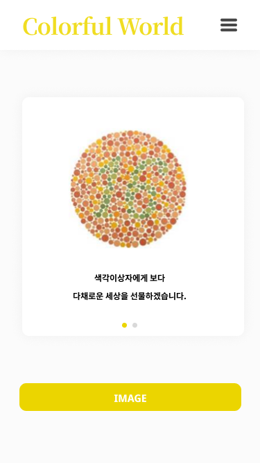
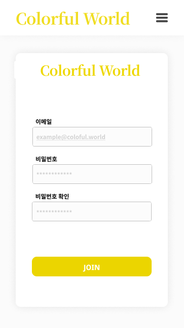
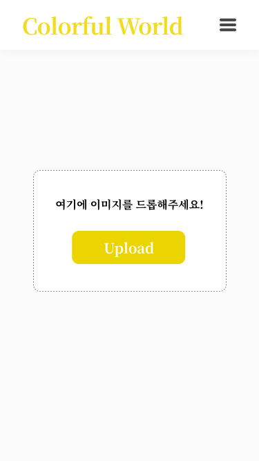
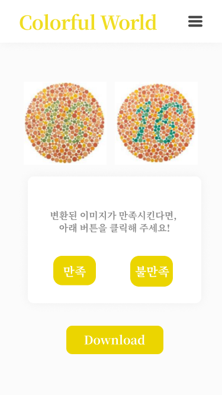

## ColorfulWorld_Frontend

색각 이상자를 위한 혼동색 영역 분류 알고리즘 개발 및 색상 보정(Front-end)

## 팀원

- [세종대학교 컴퓨터공학과 20학번 박규태][1]
- [세종대학교 컴퓨터공학과 20학번 주다현][2]

## 서비스 예시

### 시작 페이지

    
    

### 로그인 페이지, 회원가입 페이지

    
    

### 이미지 변환 페이지, 결과 페이지

    
    

## 기술 스택

   
   
   

[1]: https://github.com/KyuTae98
[2]: https://github.com/judahhh
